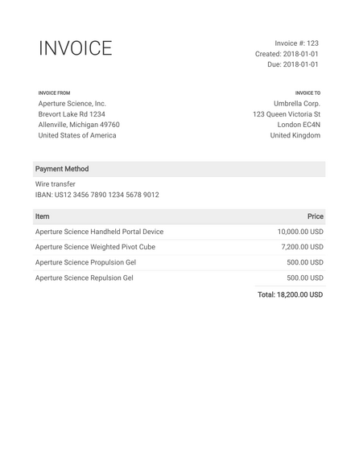

# Invoice

Template to generate HTML/PDF invoices.

Based on: https://github.com/sparksuite/simple-html-invoice-template.

## Usage

```
node build.js -l <language> -c path/to/project.json path/to/template.html
```

For [example](example), after cloning this repository, the following command:

```bash
cd example
node ../build.js -l en -c config-project.json ../invoice.html
```

will generate the following invoice:

<p align="center">
  <a href="example/invoice.pdf">
    
  </a>
</p>


## Tools

Additional accounting tools are available via separate NodeJS scripts:

- __Sum invoice totals__:
    ```bash
    node tools/invoice-sum config1.json [config2.json [...]]
    ```
    <details>
    <summary>Examples</summary>

    - Add quarterly income:
        ```bash
        $ node tools/invoice-sum path/to/invoices/2021-Q1/*/config-project.json
        { "USD": 18500 }
        ```
    - Add yearly income:
        ```bash
        $ node tools/invoice-sum path/to/invoices/2021-*/*/config-project.json
        { "USD": 74000, "EUR": 8000 }
        ``` 
    </details>

- __Identify unique entities__:
    ```bash
    node tools/invoice-entities config1.json [config2.json [...]]
    ```
    <details>
    <summary>Examples</summary>

    - Get all used entities:
        ```bash
        $ node tools/invoice-entities path/to/invoices/**/*.json
        [ { "name": "Aperture Science, Inc.",
            "address": "Brevort Lake Rd 1234",
            "zip": "49760",
            "city": "Allenville",
            "state": "Michigan",
            "country": "us" } ]
        ```
    </details>

- __Identify unique clients__:
    ```bash
    node tools/invoice-clients config1.json [config2.json [...]]
    ```
    <details>
    <summary>Examples</summary>

    - Get all known clients:
        ```bash
        $ node tools/invoice-clients path/to/invoices/**/*.json
        [ { "name": "Umbrella Corp.",
            "address": "123 Queen Victoria St",
            "zip": "EC4N",
            "city": "London",
            "country": "gb" },
          { "name": "Sherlock Holmes",
            "address": "221B Baker St",
            "zip": "NW16XE",
            "city": "London",
            "country": "gb" } ]
        ```
    </details>
